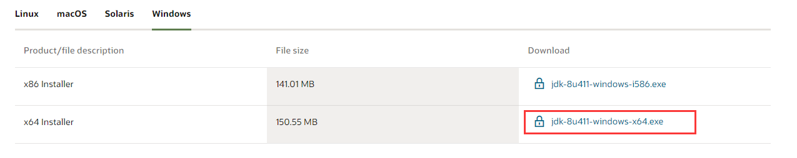
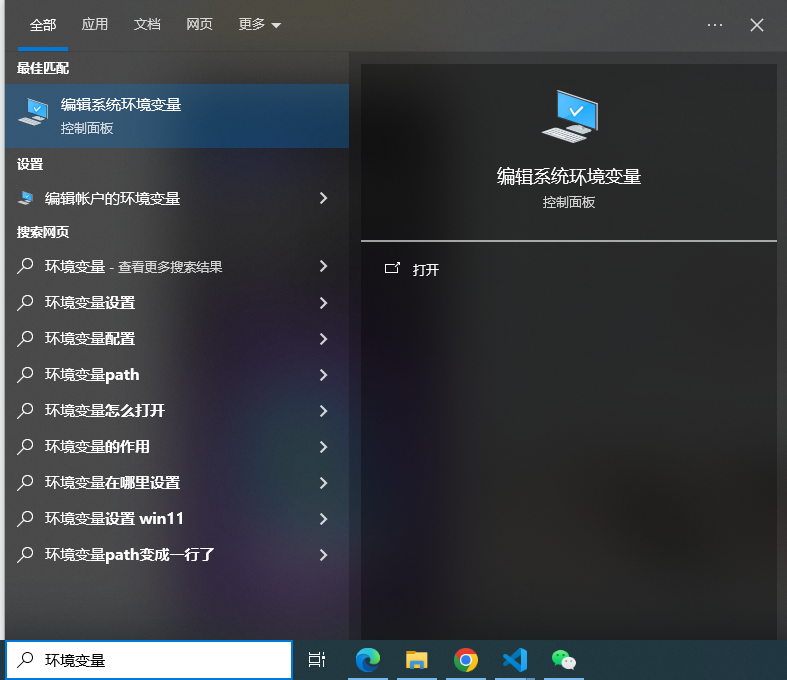
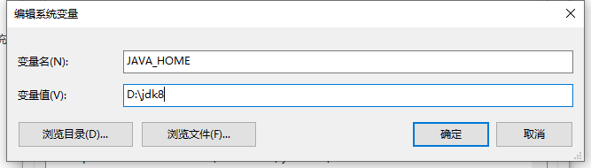
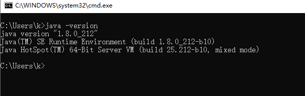

## 1、下载JDK
首先我们可以进入[点击进入](https://www.oracle.com/cn/java/technologies/downloads/)
这个网址下载所需要的JDK版本进行安装，此此文档以jdk1.8为例

进入后后找到所需jdk下载包下载即可

## 2、JDK安装
找到下载的安装包双击exe文件即可，一直点击下一步即可， 安装结束后进行环境配置

## 3、配置环境变量
在电脑搜索栏搜索环境变量，如图所示

### 3.1新增系统变量
之后点击环境变量，再点击系统变量的新增，输入一下内容
```bash 
JAVA_HOME
你的jdk安装目录
```


### 3.2配置Path
在系统变量中找到Path，点击编辑后再点击新建

变量值中输入：%JAVA_HOME%\bin  （此处bin为JDK中的bin文件路径）
```bash 
%JAVA_HOME%\bin     (JDK中的bin文件路径）
```
都配置好后，一路把窗口点击确定。  
以上便是jdk安装的所有步骤!

## 4、验证是否安装成功
win+r，并输入cmd，点击确定
在命令行输入java -version，出现jdk的版本号即代表安装并配置成功！！！
