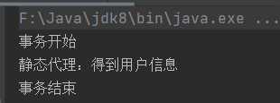
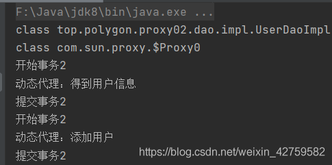
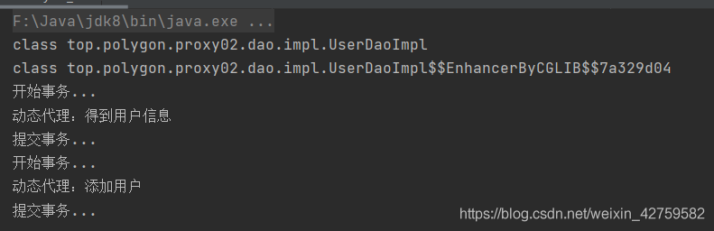

# Java代理
## 前言
**什么是代理模式？**
代理（Proxy）是一种设计模式，为其他对象提供一种代理以控制对这个对象的访问。

**代理模式的组成**
- 抽象角色：通过接口或抽象类声明真实角色实现的业务方法。
- 代理角色：实现抽象角色，是真实角色的代理，通过真实角色的业务逻辑方法来实现抽象方法，并可以附加自己的操作。
- 真实角色：实现抽象角色，定义真实角色所要实现的业务逻辑，供代理角色调用。

**代理模式的优点**  
(1).职责清晰  
真实的角色就是实现实际的业务逻辑，不用关心其他非本职责的事务，通过后期的代理完成一件完成事务，附带的结果就是编程简洁清晰。  
(2).代理对象可以在客户端和目标对象之间起到中介的作用，这样起到了中介的作用和保护了目标对象的作用。  
(3).高扩展性  
代理模式的关键点是:代理对象与目标对象.代理对象是对目标对象的扩展,并会调用目标对象。

:::caution
In development, you can only use one locale at a time.
:::

:::tip
Use this awesome feature option
:::

:::danger 警告
This action is dangerous
:::

## 1、静态代理
​静态代理在使用时，需要定义接口或者父类，被代理对象与代理对象一起实现相同的接口或者是继承相同父类。

步骤1：创建UserDao.java接口

步骤2：创建UserDaoImpl.java（UserDao接口实现类）

步骤3：创建代理类Proxy01.java（实现UserDao接口）

```java
/**
 * 代理对象，静态代理
 * */
public class Proxy01 implements UserDao {
    //接受保存目标对象
    UserDao target;
    public Proxy01() {
    }
    public Proxy01(UserDao target) {
        this.target = target;
    }
    @Override
    public void getUser() {
        // highlight-start
        System.out.println("事务开始");
        target.getUser();
        System.out.println("事务结束");
        // highlight-end
    }
}
```

步骤4：测试Proxy01_test.java

```java
/**
 * 测试静态代理
 * 静态代理：修改被代理类中的代理方法，需要修改代理类中的方法
 * 缺点:
 *
 * 因为代理对象需要与目标对象实现一样的接口,所以会有很多代理类,类太多.同时,一旦接口增加方法,目标对象与代理对象都要维护.
 * */
public class Proxy01_test {
    public static void main(String[] args) {
        //目标对象
        UserDao target = new UserDaoImpl();
        //代理对象,把目标对象传给代理对象,建立代理关系
        Proxy01 proxy = new Proxy01(target);
        proxy.getUser();//执行的是代理的方法
    }
}
```
执行结果：



总结：
- 静态代理在使用时，需要定义接口或者父类，被代理对象与代理对象一起实现接口或继承相同的父类

缺点：
- 因为代理对象需要和被代理对象实现相同的接口或父类，所以会有太多的代理类
- 一旦接口中增加了方法后，被代理对象和代理对象都需要维护（非常麻烦，不方便）


## 2、jdk动态代理
JDK中动态代理类只需要使用java.lang.reflect.Proxy.newProxyInstance方法，该方法需要接收三个参数，完整的写法是:

```java
static Object newProxyInstance(ClassLoader loader, Class<?>[] interfaces,InvocationHandler h )
```

注意该方法是在Proxy类中是静态方法，且接收的三个参数依次为:
- ClassLoader loader：指定当前目标对象使用类加载器，获取加载器的方法是固定的
- Class\<?\>[] interfaces：目标对象实现的接口类型,使用泛型方式确认类型，获取接口类型的方法是固定的
- InvocationHandler h；事件处理，执行目标对象的方法时，会触发事件处理器的方法，会把当前执行目标对象的方法作为参数传入

步骤1：创建UserDao.java接口

步骤2：创建UserDaoImpl.java（UserDao接口实现类）

步骤3：创建代理类Proxy02.java

```java
/**
 * jdk动态代理类
 * */
public class Proxy02 {
    //维护一个目标对象
    private Object target;
    public Proxy02(Object target) {
        this.target = target;
    }
    //给目标对象生成代理对象
    public Object getProxyInstance(){
        return Proxy.newProxyInstance(this.getClass().getClassLoader(), target.getClass().getInterfaces(), this::invoke);
    }
    public Object invoke(Object proxy, Method method, Object[] args) throws Throwable {
        System.out.println("开始事务2");
        //执行目标对象方法
        Object returnValue = method.invoke(target, args);
        System.out.println("提交事务2");
        return returnValue;
    }
}
```

步骤4：测试Proxy02_test.java

```java
/**
 * 测试jdk动态代理
 * 代理对象不需要实现接口,但是目标对象一定要实现接口,否则不能用动态代理
 * 接口中增加方法时只用在实现类中增加方法，不用修改代理类。
 * */
public class Proxy02_test {
    public static void main(String[] args) {
        //目标对象
        UserDao target = new UserDaoImpl();
        // 【原始的类型 class top.polygon.proxy01.dao.impl.UserDaoImpl】
        System.out.println(target.getClass());
        // 给目标对象，创建代理对象
        UserDao proxy = (UserDao) new Proxy02(target).getProxyInstance();
        // class $Proxy0   内存中动态生成的代理对象
        System.out.println(proxy.getClass());
        proxy.getUser();//执行的是代理的方法
        proxy.insertUser();
    }
}
```

运行结果：



总结：

代理对象不需要实现接口，但是目标对象一定要实现接口，否则不能用动态代理

## 3、cglib动态代理
静态代理和jdk动态代理都要求目标对象实现接口，cglib动态代理，使用以目标对象子类的方式实现代理，（当目标对象是一个单独的对象，没有实现任何接口时使用）。

Cglib代理，也叫作**子类代理**，它是在内存中构建一个子类对象从而实现对目标对象功能的扩展。Cglib是一个强大的高性能的代码生成包，它可以在运行期扩展Java类与实现Java接口。它广泛的被许多**AOP**的框架使用，为其提供方法的interception(拦截)，例如大家所熟知的Spring AOP。

​Cglib包的底层是通过使用一个小而快的字节码处理框架ASM来转换字节码并生成新的类。

Cglib子类代理需要注意的是:
- 需要引入cglib的jar包
- 代理的类不能是final，否则报错
- 目标对象的方法如果有final/static，那么不会被拦截，即不会执行目标对象额外的业务方法。

实现步骤：

步骤1：引入jar包

```java
    <dependency>
        <groupId>cglib</groupId>
        <artifactId>cglib</artifactId>
        <version>3.3.0</version>
    </dependency>
```

步骤2：创建被代理的类UserDaoImpl.java

```java
public class UserDaoImpl{
    public void getUser() {
        System.out.println("cglib动态代理：得到用户信息");
    }
    public void insertUser() {
        System.out.println("cglib动态代理：添加用户");
    }
}
```

步骤3：创建代理类Proxy03.java

```java
/**
 * cglib动态代理
 *
 * */
public class Proxy03 implements MethodInterceptor {
    //维护目标对象
    private Object target;
    public Proxy03(Object target) {
        this.target = target;
    }
    //给目标对象创建一个代理对象
    public Object getProxyInstance(){
        //1.工具类
        Enhancer en = new Enhancer();
        //2.设置父类
        en.setSuperclass(target.getClass());
        //3.设置回调函数
        en.setCallback(this);
        //4.创建子类(代理对象)
        return en.create();
    }
    @Override
    public Object intercept(Object o, Method method, Object[] objects, MethodProxy methodProxy) throws Throwable {
        System.out.println("开始事务...");
        //执行目标对象的方法
        Object returnValue = method.invoke(target, objects);
        System.out.println("提交事务...");
        return returnValue;
    }
}
```

步骤4：测试Proxy03_test.java
```java
public class Proxy03_test {
    public static void main(String[] args) {
        //目标对象
        UserDao target = new UserDaoImpl();
        System.out.println(target.getClass());
        // 给目标对象，创建代理对象
        UserDao proxy = (UserDao) new Proxy03(target).getProxyInstance();
        System.out.println(proxy.getClass());
        proxy.getUser();//执行的是代理的方法
        proxy.insertUser();
    }
}
```

运行结果：



